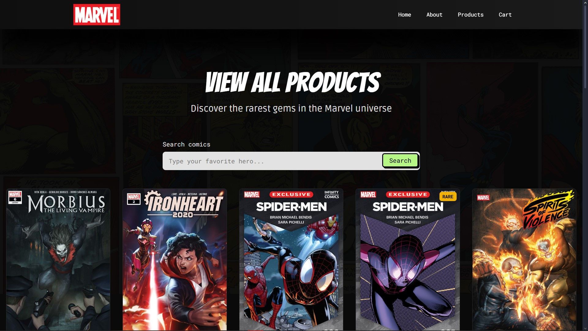
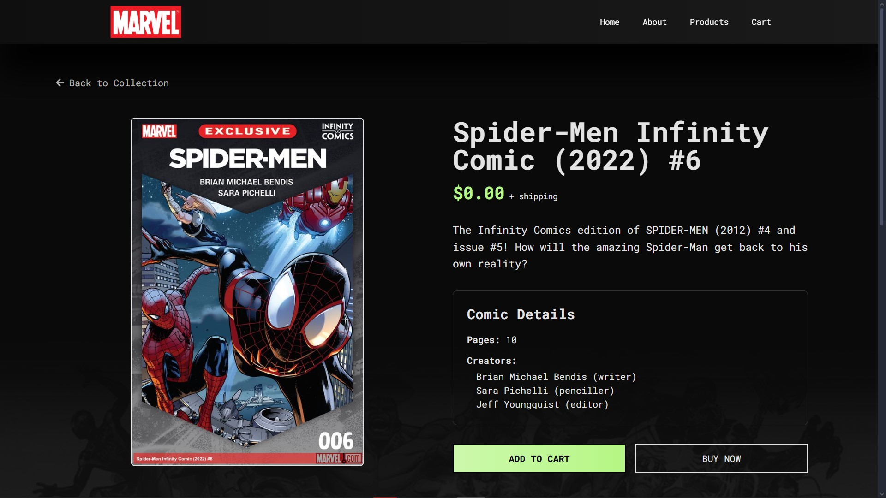
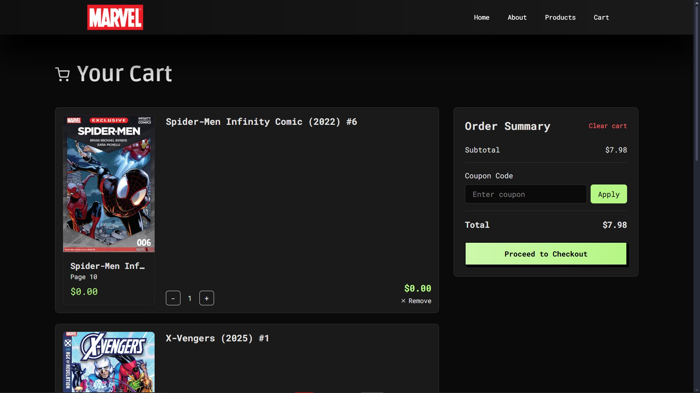

# 🚀 Marvel Comics Store

> **Desenvolvido como desafio técnico para a NeoApp** — Um e-commerce moderno e responsivo de quadrinhos da Marvel, com listagem, detalhes, carrinho e sistema de cupons.


---

## 📝 Sobre o Projeto

A **Marvel Comics Store** é uma aplicação **React + TypeScript** que simula uma loja virtual de HQs da Marvel.
O projeto foi pensado **mobile-first**, com **UI autoral** desenvolvida no **Figma** e finalizada com recursos de estilização no **Tailwind CSS** e **Framer Motion**.

O sistema conta com:

* **Listagem paginada** de HQs
* **Página de detalhes** com informações completas
* **Carrinho** funcional com cupons de desconto (comuns e raros)
* **Persistência de dados no localStorage**
* **Layout responsivo** e **animações suaves**

---

## ✅ Funcionalidades Implementadas

### **Estrutura e Layout**

* React + TypeScript + Vite
* Styled Components integrados ao Tailwind CSS
* Layout **mobile-first** e totalmente responsivo
* Componentização para reuso e manutenção

### **Catálogo de HQs**

* Listagem paginada com dados da **Marvel API**
* Grid responsivo
* Filtro de busca
* 10% dos quadrinhos marcados como **raros** de forma aleatória

### **Página de Detalhes**

* Galeria de imagens
* Informações detalhadas
* Lista de quadrinhos relacionados

### **Carrinho**

* Adicionar/remover HQs
* Ajustar quantidades
* Cálculo automático de subtotal
* Aplicação de cupons:

  * **Cupons comuns (15%)**
  * **Cupons raros (10%)**
* Validação por tipo de HQ

---

## 🛠️ Tecnologias Utilizadas

| Categoria                              | Tecnologias & Ferramentas                                        | Descrição / Uso                                                 |
| -------------------------------------- | ---------------------------------------------------------------- | --------------------------------------------------------------- |
| **Core**                               | React.js, TypeScript, Vite                            | Framework front-end moderno, tipagem estática e bundler rápido  |
| **Estilização**                        | Tailwind CSS, Styled Components, Framer Motion, React Icons | CSS utilitário, estilos dinâmicos, animações e ícones vetoriais |
| **Gerenciamento de Estado**            | React Context API, Redux Toolkit                           | Estado global e local de forma escalável e eficiente            |
| **Gerenciamento de Dados Assíncronos** | React Query                            | Fetching, cache e sincronização com API com facilidade          |
| **Roteamento**                         | React Router                                                 | Navegação SPA com rotas declarativas                            |
| **HTTP Client**                        | Axios                                                    | Comunicação com API REST da Marvel                              |
| **Persistência Local**                 | LocalStorage (via custom hooks / libs)                           | Armazenamento dos dados do carrinho e preferências              |
| **Notificações**                       | React Toastify                                             | Feedback visual para ações do usuário                           |
| **Utilitários**                        | MD5 (para hash de autenticação na API Marvel), Toastify          | Criptografia simples e notificações                             |

---

## 📂 Estrutura do Projeto

```
src/
├── api/         # Integração com APIs
├── assets/      # Imagens e recursos
├── components/  # Componentes reutilizáveis
├── contexts/    # Gerenciamento de estado
├── hooks/       # Hooks customizados
├── pages/       # Páginas da aplicação
├── providers/   # Providers de contexto
├── types/       # Tipos TypeScript
├── utils/       # Funções utilitárias
├── App.tsx
├── index.css
└── main.tsx
```

---

## 🚀 Como Rodar o Projeto

```bash
# 1. Instalar dependências
npm install

# 2. Configurar variáveis de ambiente
cp .env.example .env
# Preencher com as chaves da API Marvel

# 3. Rodar em modo desenvolvimento
npm run dev

# 4. Build para produção
npm run build
```

---

## 🎯 Cupons Disponíveis

**Cupons Comuns (15% desconto)**
`COMUM17` — `HEROIS03`

**Cupons Raros (10% desconto)**
`RARO17` — `MARVEL03`

---

## 📌 Próximos Passos

* Autenticação de usuários
* Integração com backend real
* Testes E2E com Cypress
* Avaliação de produtos

---

## 🖼️ Preview

  
*Home da loja*

  
*Listagem de produtos*

  
*Detalhes do quadrinho*

  
*Carrinho de compras*

## 🎨 Design

O design foi criado no **Figma** e refinado com **Photoshop**:
[🔗 Link para o protótipo](https://embed.figma.com/design/JnTNFmAHzwoLC1BDFnA70t/Marvel?node-id=0-1&embed-host=share)

---

## 📧 Contato

**Augusto Almondes**
📩 [almondesaugusto@gmail.com](mailto:almondesaugusto@gmail.com)
💻 [GitHub](https://github.com/AugustoAlmondes)

---